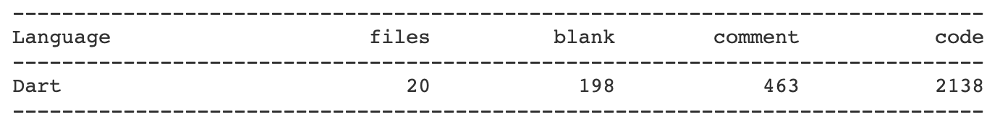
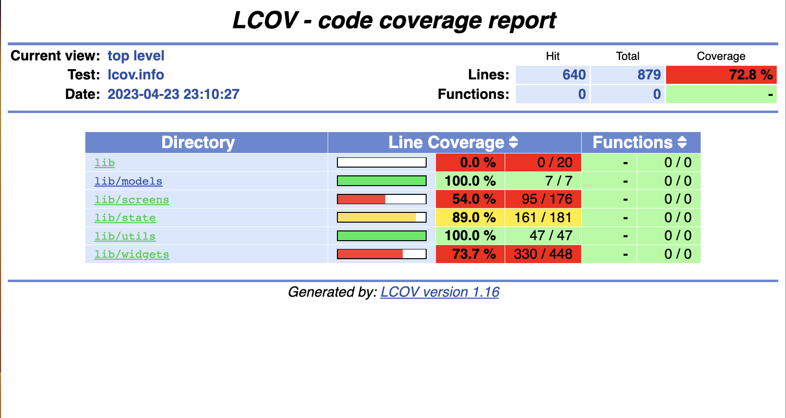
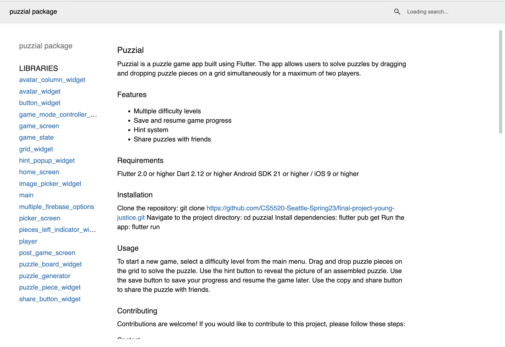

## Puzzial

Puzzial is a puzzle game app built using Flutter. The app allows users to solve puzzles by dragging and dropping puzzle pieces on a grid simultaneously for a maximum of two players.

### Features

- Multiple difficulty levels
- Save and resume game progress
- Hint system
- Share puzzles with friends

### Requirements

Flutter 2.0 or higher
Dart 2.12 or higher
Android SDK 21 or higher / iOS 9 or higher

### Project Scope



### Installation

Clone the repository: git clone https://github.com/CS5520-Seattle-Spring23/final-project-young-justice.git
Navigate to the project directory: cd puzzial
Install dependencies: flutter pub get
Run the app: flutter run

### Usage

To start a new game, select a difficulty level from the main menu.
Drag and drop puzzle pieces on the grid to solve the puzzle.
Use the hint button to reveal the picture of an assembled puzzle.
Use the save button to save your progress and resume the game later.
Use the copy and share button to share the puzzle with friends.

### Contributing

Contributions are welcome! If you would like to contribute to this project, please follow these steps:

Contact:

- Haotian Shen: GitHub h9shen1997
- Qiaozhi Liu: GitHub george-q-liu
- Xinyi Gao: GitHub vindygao1997
- Xinyi Cheng: GitHub xinyicheng1998

### Fork the repository.

- Create a new branch: git checkout -b feature/your-feature-name
- Make your changes and commit them: git commit -m 'Add some feature'
- Push to the branch: git push origin feature/your-feature-name
- Submit a pull request.

### Code Coverage

The code coverage is below:


You can also run the below commands to regenerate:

```
cd puzzial
flutter test --coverage
genhtml coverage/lcov.info -o coverage/html
open coverage/html/index.html
```

### Flutter Doc Generation

The dart doc can be viewed from the doc folder.


```
cd puzzial
open doc/api/index.html
```

You can also regenerate them using the below commands:

```
cd puzzial
dart pub global activate dartdoc
export PATH="$PATH":"$HOME/.pub-cache/bin"
dart pub global run dartdoc
open doc/api/index.html
```

### Demo Video

A demo video can be found at:

https://youtu.be/1y1-S73kaj8
